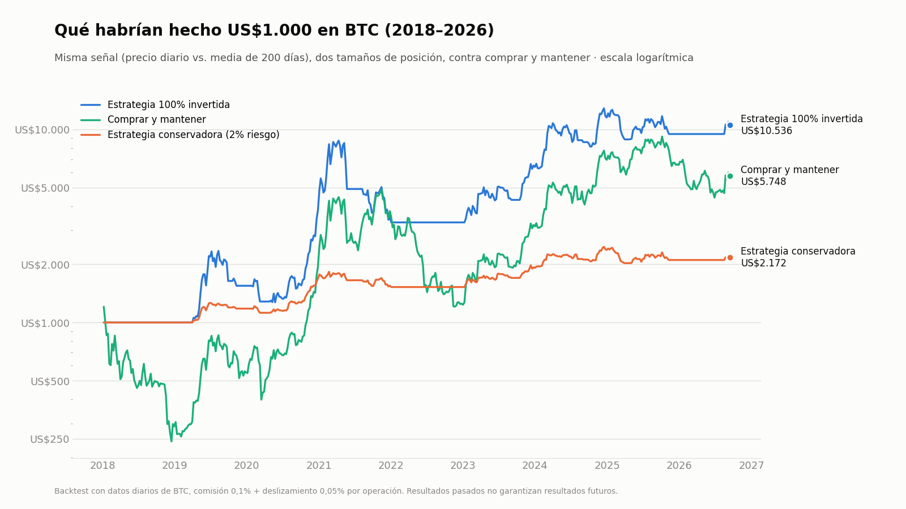
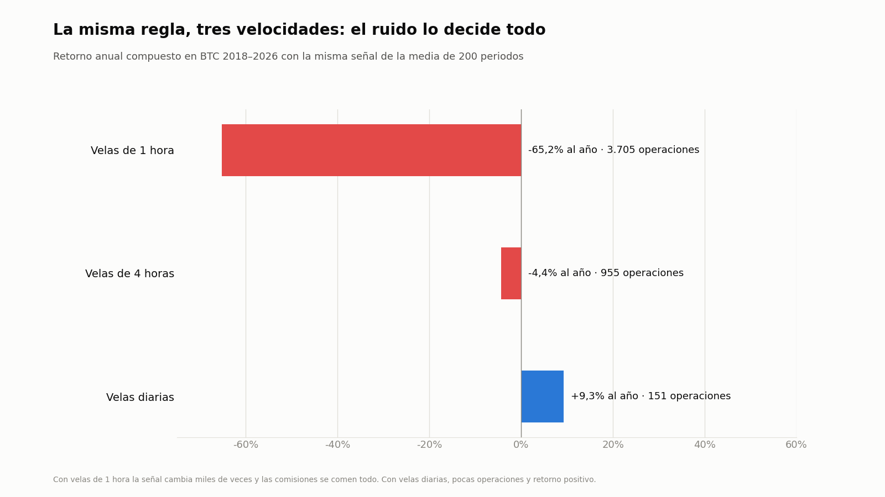
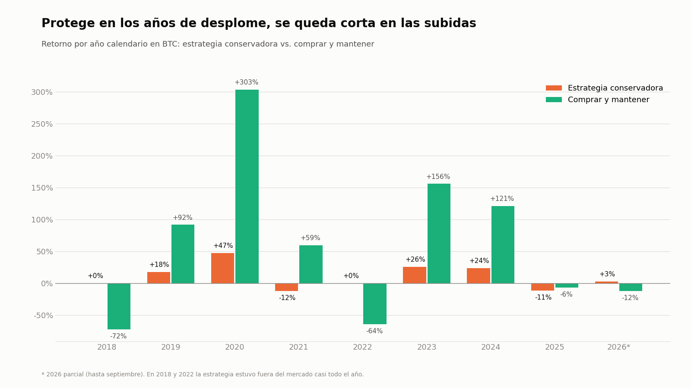
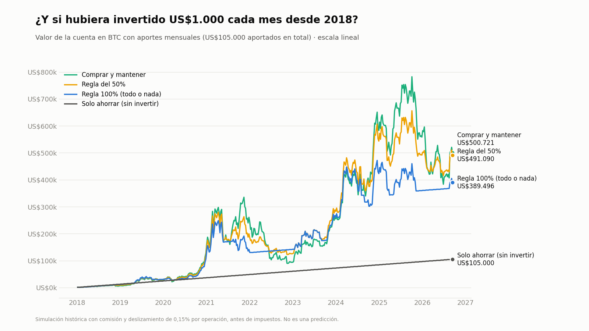

# Sistema de trading algorítmico para cripto: del backtest al bot en vivo

Proyecto personal e independiente de **Brayan Julián Abella Martínez**, estudiante de Ingeniería de Sistemas y Computación (Universidad Católica de Colombia). Lo hice por mi cuenta en septiembre de 2026; no es un trabajo académico ni está vinculado a la universidad.

**Página del proyecto:** https://julianskuu.github.io/sistema-trading-cripto/

Diseñé, probé y automaticé una estrategia de trading para Bitcoin, Ethereum y BNB. Empecé con una estrategia llena de indicadores que perdía plata. Terminé con una regla muy simple, validada en 8,7 años de datos y en 3 criptomonedas, y con un bot que la ejecuta solo, todos los días, en el entorno de pruebas de Binance.



## Resumen en 30 segundos

| | |
|---|---|
| **Regla final** | Estar en BTC cuando el precio diario cierra por encima de su media de 200 días; estar en efectivo (USDT) cuando cierra por debajo. |
| **Datos** | Velas diarias 2018-01-01 → 2026-09-13 de BTC, ETH y BNB. |
| **Resultado (BTC, versión conservadora)** | +117% total, 9,3% anual compuesto, caída máxima -18%, contra -81% de comprar y mantener. |
| **Resultado (BTC, 100% invertido)** | 31,1% anual compuesto contra 22,3% de comprar y mantener, con una caída máxima de -64% (comprar y mantener: -81%). |
| **Validación** | Sin optimizar parámetros (200 días es el valor estándar), dos periodos medidos por separado, 3 activos distintos y resultados año por año. |
| **En vivo** | Bot en Python sobre el testnet de Binance, programado con launchd, con reintentos y notificaciones de macOS. |
| **Conclusión honesta** | La regla tiene una ventaja real pero modesta. Protege en los desplomes y se queda corta en las subidas fuertes. No es una forma de hacerse rico rápido. |

## Contexto: la regla no es nueva

Seguir la tendencia con una media móvil es una idea conocida: Mebane Faber la popularizó en 2007 con una media de 10 meses para acciones y bonos ([*A Quantitative Approach to Tactical Asset Allocation*](https://papers.ssrn.com/sol3/papers.cfm?abstract_id=962461)), y hay muchos backtests públicos de la media de 200 días en Bitcoin. Este proyecto no pretende haber inventado la regla. Lo que aporta es el proceso completo: partir de una estrategia compleja que fallaba, medir el efecto de la temporalidad, validar en varios periodos y activos con costos reales, encontrar y documentar errores, y llevar la regla a un bot que corre solo.

## Cómo evolucionó el proyecto

**1. Una estrategia compleja que perdía.** La primera versión combinaba tendencia (SMA 200), fuerza de tendencia (ADX), momentum (MACD) y sobreventa (RSI) en velas de 1 hora, con stop-loss y take-profit calculados con ATR. Resultado en 8,7 años: **-55%**, mientras comprar y mantener BTC daba +466%. Tenía 240 operaciones, 25,8% de aciertos y un profit factor de 0,86 (menor que 1 significa que pierde plata en promedio). Informe completo en [`docs/01_backtest_v1_estrategia_compleja.md`](docs/01_backtest_v1_estrategia_compleja.md).

**2. El ruido de la temporalidad lo decide todo.** Quité los filtros y dejé solo la regla de la SMA 200, en tres velocidades:



Con velas de 1 hora la señal cambia miles de veces y las comisiones se comen todo. Con velas diarias hay pocas operaciones y el retorno es positivo. **Menos es más.**

**3. Validación.** Para no engañarme con resultados que solo funcionan en el pasado exacto que ya conocía:

- **Sin optimizar:** no ajusté ningún parámetro buscando el mejor resultado; 200 días es el valor estándar de esta regla.
- **Dos periodos por separado:** medí 2018-2022 y 2023-2026 de forma independiente, para ver si funcionaba en ambos y no solo en el total.
- **Otros activos:** se aplicó sin cambiar nada a ETH y BNB.
- **Año por año:** se midió el retorno de cada año calendario sin mirar el futuro.



El patrón se repite en los tres activos: **la regla protege en los años de desplome (2018, 2022) y se queda corta en los años de subida explosiva (2020, 2021, 2024).** El peor año fue BTC 2021 (-12%): el precio cruzó la media unas 10 veces en pocos meses y cada cruce compraba caro y vendía barato.

**4. El tamaño de la posición es el "dial" del riesgo.** La versión conservadora arriesga solo 2% del capital por operación, así que la mayor parte del dinero queda quieto. Con la misma señal pero 100% invertido, el retorno sube mucho, y también las caídas. No hay almuerzo gratis.

**5. Del backtest al mundo real.** Construí un bot que corre solo en mi Mac y opera con dinero ficticio en el testnet de Binance (detalles abajo).

## Resultados

Retorno anual compuesto (CAGR), caída máxima desde un pico (máx. DD) y Sharpe (retorno ajustado por riesgo; más alto es mejor). Periodo: 2018-01-01 → 2026-09-13. Comisión 0,1% y deslizamiento 0,05% por operación.

| Activo | Versión | CAGR | Máx. DD | Sharpe |
|---|---|---|---|---|
| BTC | Conservadora (2% riesgo por operación) | 9,3% | -18,1% | 0,80 |
| BTC | 100% invertida en tendencia | 31,1% | -64,4% | 0,85 |
| BTC | Comprar y mantener | 22,3% | -81,2% | 0,64 |
| ETH | Conservadora | 9,3% | -12,8% | 0,82 |
| ETH | 100% invertida | 39,6% | -73,8% | 0,88 |
| ETH | Comprar y mantener | 14,9% | -94,0% | 0,59 |
| BNB | Conservadora | 6,0% | -23,8% | 0,53 |
| BNB | 100% invertida | 43,3% | -75,8% | 0,86 |
| BNB | Comprar y mantener | 66,9% | -80,0% | 1,00 |

**Dos periodos por separado (versión conservadora, CAGR):**

| Activo | 2018-2022 | 2023-2026 |
|---|---|---|
| BTC | 8,8% | 4,7% |
| ETH | 10,4% | 4,9% |
| BNB | 7,3% | 3,5% |

Positivo en ambos periodos y en los tres activos, pero más débil en los años recientes.

**Costos reales en Colombia:** las comisiones ya están incluidas en todos los números. Además, las ganancias de trading de activos mantenidos menos de 2 años tributan como renta ordinaria, así que el retorno neto real es menor que el del backtest. Análisis en [`docs/02_validacion_por_anos_y_costos.md`](docs/02_validacion_por_anos_y_costos.md).

## El bot en vivo

```
API pública de Binance (mercado real)  →  últimas 250 velas diarias de BTCUSDT
                                        →  SMA 200 y señal del día (COMPRADO / FUERA)
                                        →  ¿cambió la señal?
                                              sí → orden de mercado en el TESTNET + notificación en macOS
                                              no → no hace nada
                                        →  trade_log.csv y state.json
```

- **Datos reales, dinero ficticio.** El testnet de Binance no guarda suficiente historial para calcular una media de 200 días, así que el precio se lee del mercado real (endpoint público, sin cuenta) y las órdenes se ejecutan en el testnet.
- **launchd en vez de cron.** En dos semanas de prueba, cron solo ejecutó el bot 4 de 14 días: macOS no recupera tareas perdidas cuando el equipo está dormido. Con launchd el bot corre cada hora y trabaja solo una vez al día (UTC), así que se pone al día apenas se prende el equipo.
- **Reintentos seguros.** Hubo fallos por `ReadTimeout` al conectar con Binance. Ahora hay timeout de 30 s y 4 intentos con espera creciente **solo para lecturas**. Las órdenes nunca se reintentan, porque reintentar una orden tras un timeout podría duplicarla.
- **Resultado de la prueba:** el bot compró en el testnet a 78.820 el 14-sep-2026. Al 27-sep iba +7,2%, frente a +9,9% que habría dado el backtest en el mismo tramo. La diferencia es que el testnet tiene su propio libro de órdenes y cobró ~2,6% más caro al comprar; no es un fallo de la estrategia.

## Dos errores que encontré (y por qué importan)

1. **Dinero que desaparecía.** La primera versión del motor de backtest no llevaba aparte el efectivo no invertido. Al cerrar cada operación, esa parte se perdía, y el resultado daba -99,99% (claramente irreal). Tras corregirlo, dio -55%. Lección: un resultado demasiado malo, o demasiado bueno, primero se audita.
2. **Un `~` que no hacía lo que parecía.** En pandas, `serie_booleana.shift(1).fillna(False)` devuelve una serie de tipo `object`, y `~` sobre objetos es el NOT bit a bit de Python (`~True == -2`, `~False == -1`: ambos "verdaderos"). La regla de entrada que yo creía "solo al cruzar hacia arriba" era en realidad "mientras el precio esté sobre la media". Todos los resultados publicados corresponden a este comportamiento real, que ahora está escrito de forma explícita en [`src/simple_trend.py`](src/simple_trend.py).

## Limitaciones

- 2018-2026 incluye uno de los mayores ciclos alcistas de la historia; no hay razón para esperar que esas tasas se repitan.
- Sesgo de supervivencia: BTC, ETH y BNB son criptos que sobrevivieron. Muchas de 2018 ya no existen.
- Los tres activos se mueven casi juntos, así que operarlos a la vez diversifica poco.
- Los datos de BTC vienen de un dataset público (CryptoCompare), no directamente de Binance.
- El bot solo se ha probado con dinero ficticio.

## Conclusiones: ¿funcionó o no?

**La respuesta corta.** Como sistema técnico, sí funcionó: la regla ganó dinero en BTC, ETH y BNB durante casi 9 años después de comisiones, en los dos periodos medidos por separado, y evitó los desplomes de 2018 y 2022. Como forma de hacerse rico, no: no adivina el futuro, no le gana al mercado en las subidas fuertes y su ganancia es moderada. El bot también funciona, pero solo se ha probado con dinero ficticio.

**Lo que sí logró:** mostrar que una estrategia complicada (−55%) puede ser peor que no hacer nada; que la velocidad de las velas importa más que las reglas; validar la regla en 3 criptos y 2 periodos sin ajustar números; reducir la peor caída (−18% conservadora, −64% al 100%, contra −81% de comprar y mantener BTC); y automatizarlo todo.

**Lo que no puede hacer:** predecir precios (entra y sale un poco tarde); ganarle al mercado en subidas fuertes; evitar pérdidas cuando el precio sube y baja sin dirección (2021, 2025); ni eliminar el riesgo.

### ¿Y si invierto US$1.000 cada mes?

Simulación con aportes mensuales en BTC (comisión y deslizamiento 0,15%, sin impuestos). Regla 100%: todo en BTC con COMPRADO, todo en efectivo con FUERA. Regla del 50%: todo en BTC con COMPRADO, la mitad con FUERA.



| Empezando en… | Aportado | Comprar y mantener | Regla del 50% | Regla 100% |
|---|---|---|---|---|
| Enero 2018 | US$105.000 | US$500.721 | US$491.090 | US$389.496 |
| Noviembre 2021 (pico) | US$59.000 | US$106.533 | US$98.806 | US$87.390 |
| Enero 2023 | US$45.000 | US$68.844 | US$62.703 | US$55.556 |

| Peor caída de la cuenta (desde 2018) | Comprar y mantener | Regla del 50% | Regla 100% |
|---|---|---|---|
| En % | −74,8% | −59,1% | −50,9% |
| En dólares | −US$412.603 | −US$249.847 | −US$159.728 |

- **Invertir cada mes le ganó a solo ahorrar en todos los casos**, incluso empezando en el pico de 2021.
- **Comprar y mantener terminó con más dinero en los tres casos.** Cuando la regla dice FUERA deja de comprar, y esos son justo los meses en que Bitcoin está más barato.
- **Las reglas cambian dinero final por tranquilidad.** Aguantar una caída de US$400.000 sin vender es muy difícil; quien vende en pánico en el fondo termina peor que cualquier opción de la tabla.
- **La regla del 50% fue el mejor punto medio:** desde 2018 terminó solo 2% por debajo de comprar y mantener, con una caída máxima bastante menor.
- **Los impuestos agrandan la diferencia:** en Colombia, mantener más de 2 años tributa como ganancia ocasional (15%); las ventas frecuentes de la regla, como renta ordinaria.

**¿Mucho o poco dinero?** Los porcentajes son los mismos: con US$100 al mes, divide todo entre 10. Con poco dinero la ganancia en dólares es pequeña y el valor está en aprender. Con mucho dinero la regla sigue funcionando (Bitcoin es muy líquido); lo difícil es aguantar ver caer una cuenta grande sin romper las reglas. Aportar cada mes reparte el riesgo de entrar en un mal momento.

### ¿Qué puede pasar en el futuro?

| Si el mercado… | Comprar y mantener | La regla |
|---|---|---|
| Sube fuerte y por mucho tiempo (2020, 2023-24) | Gana más | Gana menos: entra tarde |
| Cae fuerte y por mucho tiempo (2018, 2022) | Pierde 60-80% | Sale a tiempo y protege |
| Sube y baja sin dirección (2021, 2025) | Aguanta sin costos extra | Pierde: su peor escenario |
| Deja de crecer para siempre | Pierde | Pierde menos, pero no gana |

2018-2026 incluye una de las mayores subidas de la historia; es poco probable que se repita, así que estos números son un techo optimista, no una promesa.

### En resumen

- Lo simple le ganó a lo complejo, y la temporalidad pesó más que las reglas.
- Validar vale más que optimizar.
- Retorno y riesgo van juntos: ninguna configuración dio mucha ganancia con caídas pequeñas.
- Para quien aporta cada mes, comprar y mantener dio más dinero final; la regla sirve para quien no soportaría caídas de 70% o más.
- La ventaja es pequeña y crece con el capital y el tiempo, no con el esfuerzo. No reemplaza un ingreso.
- El mayor valor del proyecto fue lo aprendido.

Nada de esto es una recomendación de inversión: son resultados históricos simulados.

## Qué aprendí

Python y pandas para análisis de series de tiempo · diseño de un motor de backtesting (comisiones, deslizamiento, sesgo de mirar el futuro) · validación en periodos separados y en varios activos · métricas de riesgo (CAGR, drawdown, Sharpe, profit factor) · consumo de APIs REST de Binance · automatización con launchd en macOS · manejo de errores de red y operaciones idempotentes · depuración de resultados "demasiado buenos o malos para ser ciertos" · comunicar resultados con honestidad, incluidos los negativos.

## Cómo reproducirlo

```bash
git clone <este-repo> && cd sistema-trading-cripto
python3 -m venv venv && source venv/bin/activate
pip install -r requirements.txt

# Datos: ETH y BNB diarios ya vienen en data/. Para actualizarlos:
python3 scripts/download_data.py
# BTC horario (~150 MB, no incluido): descargar bitcoin-hourly-technical-indicators.csv del dataset
# público github.com/mouadja02/bitcoin-technical-indicators-dataset y guardarlo como
# data/bitcoin_hourly_indicators.csv

python3 src/simple_trend.py            # la regla SMA 200 en 1h / 4h / diario
python3 src/eth_bnb_validation.py      # ETH y BNB + validación 2018-22 vs 2023-26
python3 src/walk_forward_yearly.py     # retorno año por año
python3 src/full_allocation_comparison.py  # conservadora vs 100% invertida vs comprar y mantener
python3 src/run_backtest.py            # la estrategia compleja original (v1)
python3 src/aportes_mensuales.py       # simulación de aportes de US$1.000 al mes
```

**Bot (macOS):**

```bash
cd bot
python3 -m venv venv && venv/bin/pip install -r requirements.txt
cp .env.example .env    # poner credenciales del TESTNET (testnet.binance.vision), nunca las reales
venv/bin/python3 paper_trader.py --dry-run   # prueba sin operar
bash instalar_launchd.sh                     # dejarlo corriendo solo
```

## Estructura

```
src/        motor de backtest, indicadores, estrategias y scripts de validación
scripts/    descarga de datos desde la API pública de Binance
bot/        bot de paper trading (testnet) + instalador launchd
data/       velas diarias de ETH y BNB (BTC horario se descarga aparte)
results/    métricas en JSON, operaciones en CSV y gráficas
docs/       informes detallados de cada etapa
```

## Aviso

Proyecto educativo. Nada de esto es asesoría financiera ni garantía de resultados; los resultados pasados no garantizan resultados futuros. El bot opera solo en el testnet de Binance, con dinero ficticio.

Desarrollado con asistencia de IA (Claude, de Anthropic) para programación, análisis y revisión; las decisiones de diseño, las pruebas y la operación del bot son míos.
